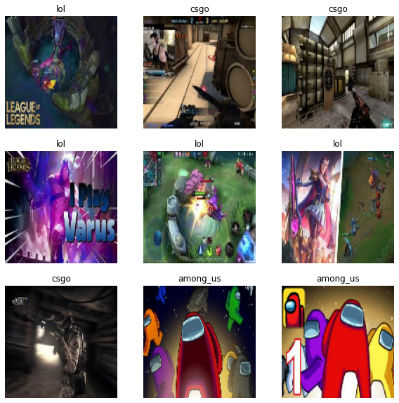

# FIZ437E HOMEWORK 4

### MLP VS CNN IMAGE CLASSIFICATION

Image classification of three different video games; Among Us, League of Legends, Counter-Strike GO

Using multi layer perceptron and convolutional neural network.

### About Data

There are 1000 images for each class. 

Example of images:

